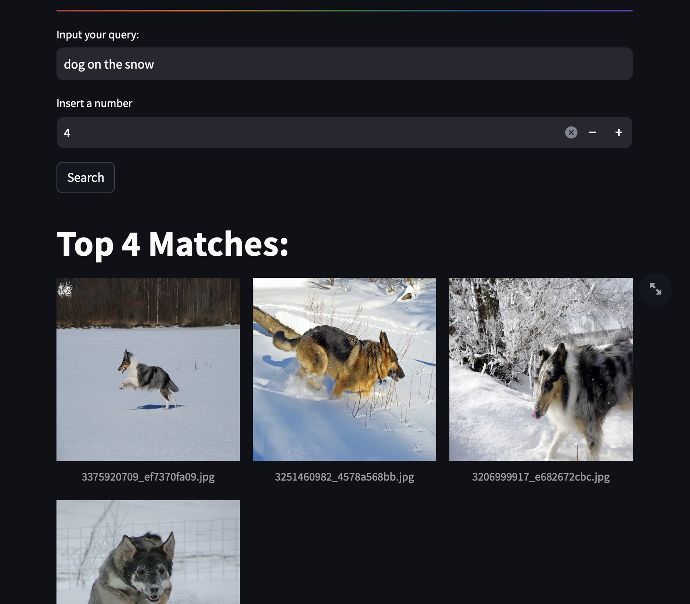

# Image Search by Text using CLIP

With the concept of this problem, a text paragraph describing the content of the images to be searched will be used, and the returned result will be the number of correct images that need to be found. 
The CLIP model is employed, where ResNet50 generates image embeddings, and DistilBERT generates text embeddings.

# Dataset
Run the script
```python
!pip install kaggle --upgrade
os.environ['KAGGLE_USERNAME'] = *********
os.environ['KAGGLE_KEY'] = ********

### For Flickr 8k
!kaggle datasets download -d adityajn105/flickr8k -p /data
!unzip /data/flickr8k.zip

## For Flickr 30k
!kaggle datasets download -d hsankesara/flickr-image-dataset -p /data
!unzip /data/flickr-image-dataset.zip
```
Or

Flickr 8k - [Kaggle Flickr 8k](https://www.kaggle.com/datasets/adityajn105/flickr8k)

Flickr 30k - [Kaggle Flickr 30k](https://www.kaggle.com/datasets/hsankesara/flickr-image-dataset)

Note: I used Flickr 8k

# Demo

